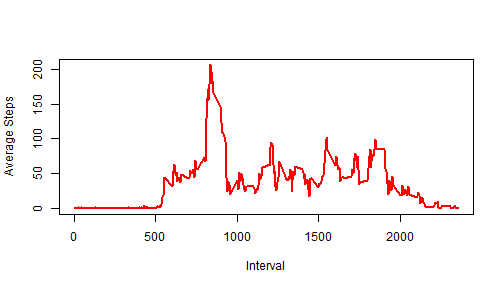

# Reproducible Research Project 1
------------------


## Loading and preprocessing the data:


```r
setwd("~/R/reproducible")
activity <- read.csv("activity.csv", stringsAsFactors=FALSE)
activity$date <- as.Date(activity$date)
str(activity)
```

```
## 'data.frame':	17568 obs. of  3 variables:
##  $ steps   : int  NA NA NA NA NA NA NA NA NA NA ...
##  $ date    : Date, format: "2012-10-01" "2012-10-01" ...
##  $ interval: int  0 5 10 15 20 25 30 35 40 45 ...
```

## What is mean total number of steps taken per day?


```r
#calc Total steps per day
meansdate1 <- tapply(activity$step, activity$date, sum, na.rm=TRUE)
stepsmean <- mean(meansdate1)
stepsmedian <- median(meansdate1)
```

The mean number of steps per day is 9354.2295082  and the median number of steps per day is 10395.


```r
#plot histogram of Total steps per day
hist(meansdate1, xlab= "Total Steps per Day", ylab= "Frequency", col='red', main="Histogram of Total Steps per Day", breaks=10)
```

 

## What is the average daily activity pattern?


```r
#calc interval means
means1 <- tapply(activity$step, activity$interval, mean, na.rm=TRUE)
#find largest mean
#find largest mean
largest_mean <- means1[which.max(means1)]
largest_mean_interval <-  names(largest_mean)
```

The 5-minute interval, on average across all the days in the dataset, that contains the maximum number of steps is interval 835 with a value of 206.1698113.   


This is a plot of the Average Steps per interval:

```r
#plot the means by interval
plot(names(means1), means1, type="l", xlab= "Interval", ylab= "Average Steps", col="red" , lwd=2)
```

 

## Imputing missing values


How many NA's are there in the activity dataset?


```r
#find number of NA's
length(is.na(activity)==TRUE)
```

```
## [1] 52704
```

We will impute the values for the NA's by settting them equal to the mean for that 5-minute interval.    

First create a dataframe (df1) of interval means by using the data from above, so that we can use this for the NA's:

```r
#
#match the data types in activity
interval <- as.vector(as.integer(names(means1)))
mean_vals <- as.vector(means1)
df_interval_means <- as.data.frame(interval)
df_interval_means$means <- as.vector(as.integer(round(mean_vals)))
```


Make copy of the activity dataframe (activity_imp) to use for imputed dataset, and set the NA's equal to the mean for that interval:


```r
activity_imp <- activity
#merge in the means into a column
activity_imp <- merge(activity_imp, df_interval_means, by.x="interval", by.y="interval")
#set the steps equal to the interval mean where steps is NA
activity_imp[which(is.na(activity_imp$steps)==TRUE),2] <- activity_imp[which(is.na(activity_imp$steps)==TRUE),4]
```


```r
#calc interval means
meansdate2 <- tapply(activity_imp$step, activity_imp$date, sum, na.rm=TRUE)
stepsmean2 <- mean(meansdate2)
stepsmedian2 <- median(meansdate2)
```

The mean number of steps per day with the imputed dataframe is 1.0765639 &times; 10<sup>4</sup>  and the median number of steps per day is 10762.  These are different from the original dataset.  After imputing with the interval means, both the mean and the median increased.  


Here is a histogram of the imputed dataset:

```r
#plot histogram of Total steps per day on new data set
hist(meansdate2, xlab= "Total Steps per Day", ylab= "Frequency", col='red', main="Histogram of Total Steps per Day (with imputation)", breaks=10)
```

 

## Are there differences in activity patterns between weekdays and weekends?

Create "weekend"" factor variable for weekday/weekend:


```r
activity_imp$weekend <- "weekday"
activity_imp$weekend[which(weekdays(activity_imp$date) %in% c("Saturday", "Sunday"))] <- "weekend"
activity_imp$weekend <- as.factor(activity_imp$weekend)
#str(activity_imp)
```

Here is a panel plot containing a time series plot of the 5-minute interval (x-axis) and the average number of steps taken, averaged across all weekday days or weekend days (y-axis) using the imputed dataframe:


```r
#aggregate the data by weekday and weekend
agg <- aggregate(activity_imp, list(interval=activity_imp$interval, weekend=activity_imp$weekend), mean)
agg <- agg[,c(1,2,4)]

#make lattice panel plot
library(lattice) 
xyplot(agg$steps~agg$interval|agg$weekend, 
       main="Average Steps per Interval",
       xlab="Interval", 
       ylab="Number of Steps", 
       type = "l" ,
       layout=c(1,2))
```

 
